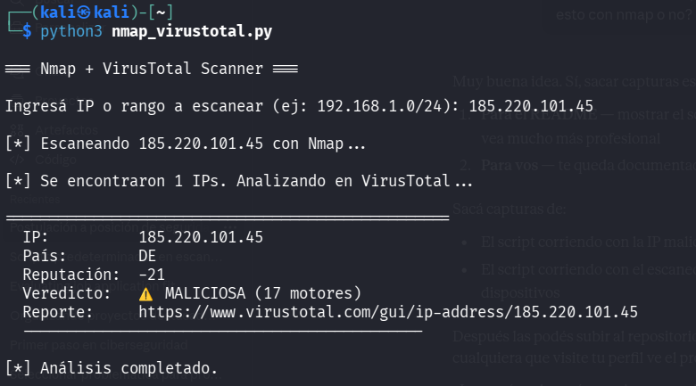

# Nmap + VirusTotal Scanner

Script en Python que combina Nmap y VirusTotal para escanear
una red y analizar automáticamente si las IPs encontradas
son maliciosas o no.

## ¿Qué hace?

- Escanea una IP o rango de red usando Nmap
- Toma las IPs encontradas y las consulta en VirusTotal
- Muestra país, reputación y veredicto de cada IP
- Identifica IPs maliciosas, sospechosas o limpias

## Uso

Ingresá una IP o rango cuando te lo pida:
- IP individual: `185.220.101.45`
- Rango de red: `192.168.88.0/24`

## Ejemplos

## IP maliciosa detectada

## IP limpia (Google DNS)

## Tecnologías usadas

- Python 3
- Nmap
- VirusTotal API v3
- Librería requests
